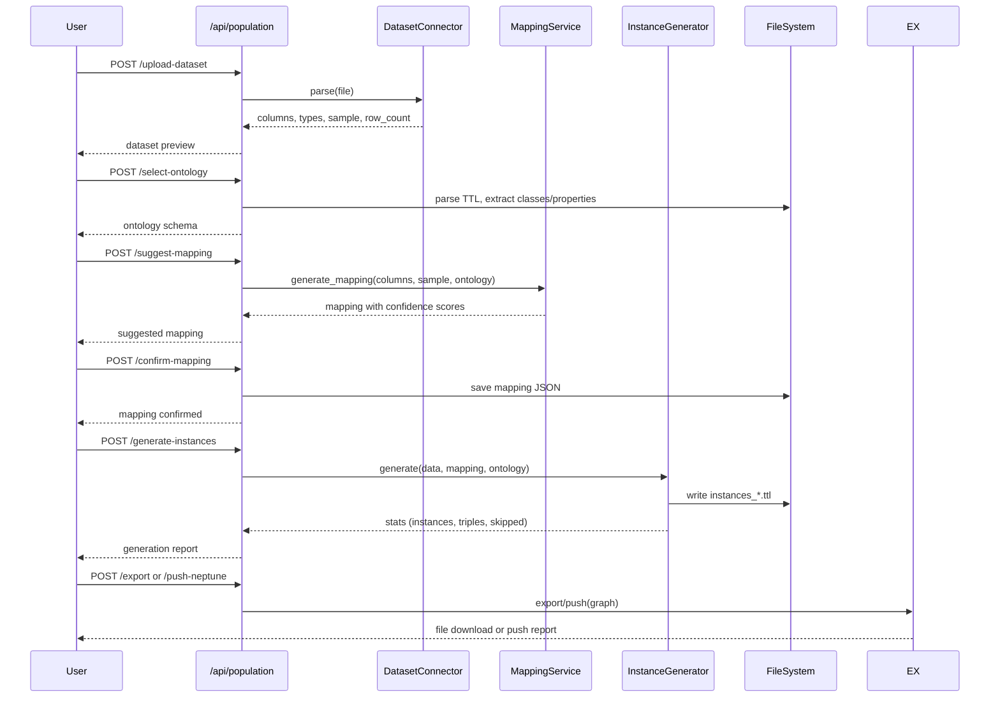

# Design Document: Data Population

## Overview

This feature extends KG Studio with the ability to populate existing ontologies with real data instances. Users who have built an ontology (TTL file with OWL classes and properties) can upload datasets (CSV, JSON, XML) or connect to SPARQL endpoints, map dataset columns to ontology classes/properties with LLM assistance, generate RDF instances, and export or push the populated graph to Neptune.

The design builds on the existing `explorer/routes/mapper.py` pattern but introduces a more robust, session-based workflow with LLM-assisted mapping, incremental loading, and batch export capabilities.

### Key Design Decisions

1. **Session-based architecture**: A `Population_Session` object tracks the full lifecycle (dataset → mapping → generation → export) to enable incremental loading and mapping reuse.
2. **New route module**: A dedicated `explorer/routes/population.py` keeps data population logic separate from the existing mapper (which handles simpler one-shot mapping).
3. **LLM with heuristic fallback**: The mapping service uses `llm_manager.generate_json()` for suggestions but falls back to string-similarity heuristics when the LLM is unavailable.
4. **rdflib for all RDF operations**: Consistent with the existing codebase — no new RDF libraries.
5. **File-based persistence**: Mappings and instance data are stored as JSON/TTL files within the project directory, matching the existing project structure.

## Architecture

```mermaid
graph TD
    subgraph Frontend [studio.html]
        UI[Population UI Panel]
    end

    subgraph Backend [FastAPI]
        POP[/api/population/*]
        DS[Dataset Connector]
        MS[Mapping Service]
        IG[Instance Generator]
        EX[Export/Push Service]
    end

    subgraph Storage [File System]
        PROJ[projects/{id}/]
        TTL[*.ttl ontology files]
        INST[instances_*.ttl]
        MAP[mappings/*.json]
    end

    subgraph External
        LLM[LLM Provider]
        NEP[Neptune/SPARQL Endpoint]
    end

    UI --> POP
    POP --> DS
    POP --> MS
    POP --> IG
    POP --> EX
    MS --> LLM
    DS --> PROJ
    IG --> INST
    EX --> NEP
    POP --> MAP
    DS --> NEP
```

### Request Flow



## Components and Interfaces

### 1. Population Router (`explorer/routes/population.py`)

The main API router exposing all data population endpoints.

```python
router = APIRouter(prefix="/api/population", tags=["population"])
```

**Endpoints:**

| Method | Path | Description |
|--------|------|-------------|
| POST | `/upload-dataset` | Upload CSV/JSON/XML file, return parsed preview |
| POST | `/connect-database` | Connect to Neptune/SPARQL endpoint |
| POST | `/query-database` | Execute SPARQL query on connected endpoint |
| GET | `/{project_id}/ontologies` | List TTL files with class/property counts |
| POST | `/{project_id}/select-ontology` | Parse and extract ontology schema |
| POST | `/{project_id}/suggest-mapping` | LLM-assisted mapping suggestion |
| POST | `/{project_id}/confirm-mapping` | Validate and persist mapping |
| POST | `/{project_id}/generate-instances` | Generate RDF instances from data + mapping |
| GET | `/{project_id}/sessions` | List active population sessions |
| GET | `/{project_id}/mappings` | List saved mappings |
| GET | `/{project_id}/mappings/{mapping_id}` | View a saved mapping |
| DELETE | `/{project_id}/mappings/{mapping_id}` | Delete a saved mapping |
| POST | `/{project_id}/export` | Export populated graph in TTL/N-Triples/JSON-LD |
| POST | `/{project_id}/push-neptune` | Push triples to Neptune in batches |
| POST | `/{project_id}/push-neptune/retry` | Retry from a failed batch |

### 2. Dataset Connector (`explorer/services/dataset_connector.py`)

Responsible for parsing uploaded files and connecting to external data sources.

```python
class DatasetConnector:
    def parse_csv(self, content: bytes) -> DatasetPreview: ...
    def parse_json(self, content: bytes) -> DatasetPreview: ...
    def parse_xml(self, content: bytes) -> DatasetPreview: ...
    def flatten_json(self, obj: dict, prefix: str = "") -> dict: ...
    def connect_neptune(self, endpoint: str, port: int) -> ConnectionStatus: ...
    def connect_sparql(self, endpoint_url: str) -> ConnectionStatus: ...
    def execute_query(self, session_id: str, query: str) -> TabularResult: ...
```

### 3. Mapping Service (`explorer/services/mapping_service.py`)

Generates mapping suggestions using LLM with heuristic fallback.

```python
class MappingService:
    def __init__(self, llm_manager: LLMProviderManager): ...
    def suggest_mapping(self, columns: list, sample: list, ontology: OntologySchema) -> MappingSuggestion: ...
    def heuristic_mapping(self, columns: list, ontology: OntologySchema) -> MappingSuggestion: ...
    def validate_mapping(self, mapping: ConfirmedMapping, ontology: OntologySchema) -> ValidationResult: ...
    def compute_similarity(self, col_name: str, property_label: str) -> float: ...
```

### 4. Instance Generator (`explorer/services/instance_generator.py`)

Transforms data rows into RDF triples based on confirmed mappings.

```python
class InstanceGenerator:
    def generate(self, data: list[dict], mapping: ConfirmedMapping, 
                 base_uri: str, existing_graph: RDFGraph | None = None) -> GenerationResult: ...
    def build_uri(self, base_uri: str, identifier: str) -> URIRef: ...
    def create_typed_literal(self, value: str, datatype: str) -> Literal: ...
    def merge_instances(self, existing: RDFGraph, new: RDFGraph) -> MergeResult: ...
```

### 5. Export Service (`explorer/services/export_service.py`)

Handles multi-format export and Neptune push with batching.

```python
class ExportService:
    def export_graph(self, graph: RDFGraph, format: str) -> bytes: ...
    def push_to_neptune(self, graph: RDFGraph, endpoint: str, 
                        batch_size: int = 1000, start_batch: int = 0) -> PushResult: ...
    def create_batches(self, graph: RDFGraph, batch_size: int) -> list[list[tuple]]: ...
```

## Data Models

### DatasetPreview

```python
@dataclass
class DatasetPreview:
    source_type: str  # "csv", "json_array", "json_object", "xml"
    columns: list[ColumnInfo]
    row_count: int
    sample: list[dict]  # up to 10 rows
    filename: str | None = None

@dataclass
class ColumnInfo:
    name: str
    inferred_type: str  # "string", "integer", "float", "boolean", "date", "uri"
    sample_values: list[str]  # up to 5 sample values
    null_count: int
```

### OntologySchema

```python
@dataclass
class OntologySchema:
    classes: list[OntologyClass]
    object_properties: list[OntologyProperty]
    datatype_properties: list[OntologyProperty]

@dataclass
class OntologyClass:
    uri: str
    label: str
    local_name: str  # fragment after # or last /

@dataclass
class OntologyProperty:
    uri: str
    label: str
    local_name: str
    domain: str | None  # class URI or None if unrestricted
    range: str | None   # class URI or XSD type
```

### MappingSuggestion

```python
@dataclass
class MappingSuggestion:
    target_class: str  # ontology class URI
    id_column: str
    label_column: str
    column_mappings: list[ColumnMapping]

@dataclass
class ColumnMapping:
    column_name: str
    mapped_property: str | None  # ontology property URI, None if unmapped
    mapping_type: str  # "datatype", "object", "skip", "unmapped"
    confidence: float  # 0.0 to 1.0
    target_class: str | None  # for object properties, the target class
```

### ConfirmedMapping

```python
@dataclass
class ConfirmedMapping:
    id: str  # UUID
    project_id: str
    ontology_file: str
    target_class: str
    id_column: str
    label_column: str
    column_mappings: list[ColumnMapping]
    created_at: float
    dataset_columns: list[str]  # original column headers for reuse matching
```

### PopulationSession

```python
@dataclass
class PopulationSession:
    session_id: str  # UUID
    project_id: str
    dataset: DatasetPreview | None
    ontology: OntologySchema | None
    mapping: ConfirmedMapping | None
    data_rows: list[dict]  # full dataset
    db_connection: Any | None  # active database connection
    created_at: float
```

### GenerationResult

```python
@dataclass
class GenerationResult:
    ttl: str  # generated Turtle content
    graph: RDFGraph
    instances_created: int
    instances_updated: int  # for incremental loads
    triples_generated: int
    rows_skipped: int  # rows with missing identifier
    skipped_reasons: list[str]
```

### PushResult

```python
@dataclass
class PushResult:
    success: bool
    total_triples: int
    triples_pushed: int
    batches_completed: int
    total_batches: int
    failed_batch: int | None  # batch index that failed, for retry
    error: str | None
```

### File Storage Layout

```
projects/{project_id}/
├── meta.json
├── model.ttl              # ontology
├── instances_*.ttl        # generated instance files
└── mappings/
    ├── mapping_abc123.json
    └── mapping_def456.json
```

### Mapping JSON Schema (persisted)

```json
{
  "id": "abc123",
  "project_id": "my_project",
  "ontology_file": "model.ttl",
  "target_class": "http://kg.local/ontology#Service",
  "id_column": "service_id",
  "label_column": "service_name",
  "column_mappings": [
    {
      "column_name": "description",
      "mapped_property": "http://kg.local/ontology#description",
      "mapping_type": "datatype",
      "confidence": 0.95,
      "target_class": null
    },
    {
      "column_name": "depends_on",
      "mapped_property": "http://kg.local/ontology#dependsOn",
      "mapping_type": "object",
      "confidence": 0.8,
      "target_class": "http://kg.local/ontology#Service"
    }
  ],
  "created_at": 1700000000.0,
  "dataset_columns": ["service_id", "service_name", "description", "depends_on"]
}
```

## Correctness Properties

*A property is a characteristic or behavior that should hold true across all valid executions of a system — essentially, a formal statement about what the system should do. Properties serve as the bridge between human-readable specifications and machine-verifiable correctness guarantees.*

### Property 1: CSV parsing returns accurate metadata

*For any* valid CSV byte string with N rows and M columns, parsing it SHALL return exactly M column names matching the header row, a row_count equal to N, and a sample of size min(N, 10).

**Validates: Requirements 1.1**

### Property 2: JSON array parsing returns accurate metadata

*For any* valid JSON byte string containing an array of N objects with field set F, parsing it SHALL return field names equal to F, a record_count equal to N, and a sample of size min(N, 10).

**Validates: Requirements 1.2**

### Property 3: JSON flattening preserves all leaf values

*For any* nested JSON object, flattening to dot-notation keys SHALL produce a flat dictionary where every leaf value in the original object is accessible via its dot-notation path, and no leaf values are lost.

**Validates: Requirements 1.3**

### Property 4: Invalid input produces descriptive errors without crashes

*For any* byte sequence that is not valid CSV, JSON, or XML, the Dataset_Connector SHALL return an error response (not raise an unhandled exception) containing a non-empty error message.

**Validates: Requirements 1.6**

### Property 5: SPARQL results are correctly formatted as tabular data

*For any* SPARQL SELECT result set with variables V and bindings B, formatting it as tabular data SHALL produce column headers equal to V and rows where each cell corresponds to the correct variable binding.

**Validates: Requirements 2.3**

### Property 6: Error messages never expose credentials

*For any* connection configuration containing credentials (passwords, tokens), when a connection error occurs, the error message SHALL NOT contain any substring matching the credential values.

**Validates: Requirements 2.4**

### Property 7: Ontology extraction is complete

*For any* valid TTL file containing OWL classes C, object properties OP, and datatype properties DP with their domains and ranges, parsing SHALL return all elements of C, OP, and DP with correct domain/range associations.

**Validates: Requirements 3.1, 3.2**

### Property 8: Mapping suggestions contain all required fields and valid confidence scores

*For any* dataset columns and ontology schema, the mapping suggestion SHALL contain a target_class, id_column, label_column, and a column_mapping entry for every input column, where each confidence score is in the range [0.0, 1.0].

**Validates: Requirements 4.1, 4.3**

### Property 9: Higher similarity yields higher confidence

*For any* column name that is an exact case-insensitive match to an ontology property label, the confidence score for that mapping SHALL be greater than or equal to the confidence score for any column that does not match any property label.

**Validates: Requirements 4.4**

### Property 10: Heuristic fallback produces valid mappings

*For any* set of columns and ontology schema, when the LLM is unavailable, the heuristic mapper SHALL produce a mapping with the same structure as the LLM mapper (target_class, id_column, label_column, column_mappings with confidence scores in [0, 1]).

**Validates: Requirements 4.5**

### Property 11: Unmapped columns are flagged

*For any* dataset column whose name has zero string similarity (no common substring > 2 chars) with any ontology property label, the mapping SHALL mark that column as "unmapped".

**Validates: Requirements 4.6**

### Property 12: Skipped columns produce no triples

*For any* confirmed mapping where one or more columns are marked as "skip", the generated RDF SHALL contain zero triples using those columns' mapped properties as predicates.

**Validates: Requirements 5.3**

### Property 13: Domain validation rejects invalid assignments

*For any* ontology where property P has domain restricted to class A, assigning P to a column mapped to class B (where B ≠ A and B is not a subclass of A) SHALL fail validation.

**Validates: Requirements 5.4**

### Property 14: Instance generation produces correct count and valid RDF

*For any* dataset with N rows where K rows have non-empty identifier values, instance generation SHALL produce exactly K named individuals, and the total reported instances_created SHALL equal K, rows_skipped SHALL equal N - K, and the output SHALL be parseable as valid Turtle by rdflib.

**Validates: Requirements 6.1, 6.5, 6.6, 6.7**

### Property 15: Generated URIs are unique for unique identifiers

*For any* dataset where all identifier column values are distinct, all generated instance URIs SHALL be distinct.

**Validates: Requirements 6.2**

### Property 16: Triple generation matches mapping type

*For any* data row and confirmed mapping, each non-empty cell mapped to a datatype property SHALL produce a triple (instance, property, typed_literal), and each non-empty cell mapped to an object property SHALL produce a triple (instance, property, resource_URI).

**Validates: Requirements 6.3, 6.4**

### Property 17: Incremental loading preserves existing triples

*For any* existing RDF graph G and new dataset D, after incremental loading, every triple in G SHALL still be present in the resulting graph.

**Validates: Requirements 7.1**

### Property 18: Duplicate identifiers merge rather than duplicate

*For any* existing graph containing instance I with URI U, and new data containing a row with the same identifier value, the resulting graph SHALL contain exactly one instance with URI U (not two), and that instance SHALL have triples from both the original and new data.

**Validates: Requirements 7.2**

### Property 19: Export contains both schema and instances

*For any* populated project with ontology O and instances I, exporting in any supported format SHALL produce output that, when parsed, contains all triples from O and all triples from I.

**Validates: Requirements 9.2**

### Property 20: Neptune push batches never exceed 1000 triples

*For any* RDF graph with T triples, creating batches for Neptune push SHALL produce ceil(T / 1000) batches where each batch contains at most 1000 triples and the union of all batches equals the full triple set.

**Validates: Requirements 9.3**

### Property 21: Failed batch retry resumes correctly

*For any* push operation that fails at batch index F, retrying from batch F SHALL skip the first F batches and resume from the (F+1)th batch onward.

**Validates: Requirements 9.5**

### Property 22: Mapping serialization round-trip

*For any* valid ConfirmedMapping object, serializing it to JSON and deserializing it back SHALL produce an equivalent mapping object.

**Validates: Requirements 10.1**

### Property 23: Mapping reuse suggested on matching headers

*For any* saved mapping with dataset_columns C, uploading a new dataset whose column headers exactly equal C SHALL trigger a reuse suggestion, and uploading a dataset with different headers SHALL NOT trigger a reuse suggestion.

**Validates: Requirements 10.2**

### Property 24: Stale mapping references are flagged

*For any* saved mapping referencing ontology class X or property Y, if X or Y no longer exists in the current ontology file, validation SHALL flag those references as invalid.

**Validates: Requirements 10.4**

## Error Handling

### File Upload Errors

| Error Condition | Response Code | Behavior |
|----------------|---------------|----------|
| File exceeds 50 MB | 413 | Return `{"error": "File exceeds maximum size of 50 MB"}` |
| Invalid encoding | 400 | Return `{"error": "File encoding not supported. Use UTF-8."}` |
| Unparseable format | 400 | Return `{"error": "Could not parse file as {format}: {detail}"}` |
| Unsupported format | 400 | Return `{"error": "Unsupported file format. Use CSV, JSON, or XML."}` |

### Database Connection Errors

| Error Condition | Response Code | Behavior |
|----------------|---------------|----------|
| Connection timeout (>10s) | 504 | Return `{"error": "Connection timed out after 10 seconds"}` |
| Authentication failure | 401 | Return `{"error": "Authentication failed. Check credentials."}` — no credential values in message |
| Network unreachable | 502 | Return `{"error": "Could not reach endpoint: {sanitized_url}"}` |
| Invalid SPARQL query | 400 | Return `{"error": "SPARQL query error: {detail}"}` |

### Mapping Errors

| Error Condition | Response Code | Behavior |
|----------------|---------------|----------|
| LLM unavailable | 200 | Fall back to heuristic mapping, include `"fallback": true` in response |
| LLM returns invalid JSON | 200 | Fall back to heuristic mapping, log LLM error |
| Domain validation failure | 400 | Return `{"error": "Property {prop} has domain {domain}, incompatible with class {class}"}` |
| No ontology classes found | 400 | Return `{"error": "Selected file contains no OWL classes to populate", "warning": true}` |

### Instance Generation Errors

| Error Condition | Response Code | Behavior |
|----------------|---------------|----------|
| No data rows | 400 | Return `{"error": "No data rows to process"}` |
| All rows missing identifier | 400 | Return `{"error": "All rows are missing values in identifier column '{col}'"}` |
| Invalid TTL generation | 500 | Return `{"error": "Internal error generating RDF: {detail}"}` — should not occur if mapping is validated |

### Neptune Push Errors

| Error Condition | Response Code | Behavior |
|----------------|---------------|----------|
| Batch insert failure | 502 | Return `{"error": "Batch {n} failed: {detail}", "batches_completed": n-1, "triples_pushed": count, "retry_from": n}` |
| Endpoint unreachable | 502 | Return `{"error": "Neptune endpoint unreachable"}` |

### General Principles

- All errors return JSON with an `"error"` key containing a human-readable message.
- Credentials, tokens, and passwords are never included in error messages.
- Partial successes (e.g., some rows skipped) return 200 with a report including skip reasons.
- LLM failures are non-fatal — the system always falls back to heuristic mapping.

## Testing Strategy

### Property-Based Tests (using Hypothesis)

The feature has significant pure-function logic suitable for property-based testing:

- **Dataset parsing** (CSV, JSON, XML → structured output)
- **JSON flattening** (nested → dot-notation)
- **Instance generation** (data + mapping → RDF triples)
- **Batch creation** (triples → batches of ≤ 1000)
- **Mapping serialization** (round-trip JSON)
- **Confidence scoring** (invariants on score ranges)
- **Incremental merge** (preservation of existing triples)

**Configuration:**
- Library: `hypothesis` (Python)
- Minimum iterations: 100 per property
- Each test tagged with: `# Feature: data-population, Property {N}: {title}`

### Unit Tests (pytest)

Focus on specific examples and edge cases:

- File size rejection at 50 MB boundary
- Empty/null cell handling in instance generation
- TTL file with no OWL classes warning
- Mapping reuse detection with exact vs. partial header matches
- XML attribute-to-tabular conversion with specific structures
- Credential masking in error messages (specific credential patterns)

### Integration Tests

- LLM-assisted mapping with real LLM provider (ollama)
- Neptune push with mock SPARQL endpoint (httpx mock)
- Full workflow: upload → map → generate → export
- Database connection timeout behavior
- Session lifecycle (create, query, reuse, cleanup)

### Test File Structure

```
tests/
├── test_dataset_connector.py      # Property + unit tests for parsing
├── test_mapping_service.py        # Property + unit tests for mapping logic
├── test_instance_generator.py     # Property + unit tests for RDF generation
├── test_export_service.py         # Property + unit tests for export/batching
├── test_population_api.py         # Integration tests for API endpoints
└── conftest.py                    # Shared fixtures (sample ontologies, datasets)
```
