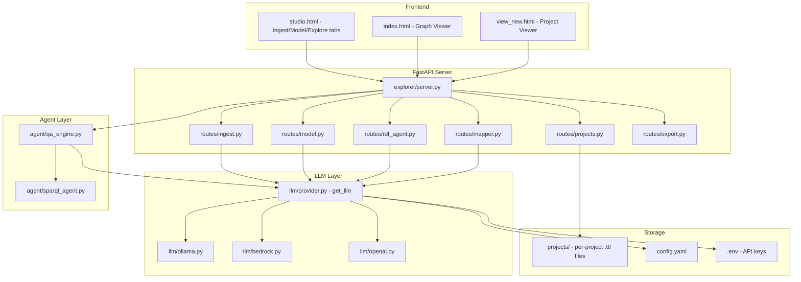
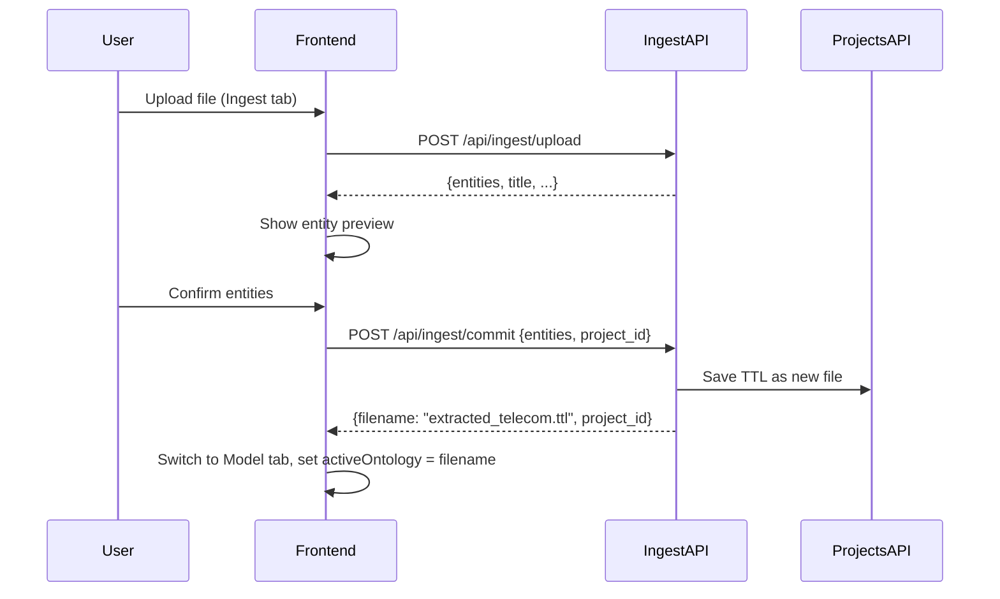

# Design Document: KG Studio Consolidation

## Overview

This design consolidates the KG Studio codebase to make the core user flow reliable and clean: **Ingest → Model → Build → Explore/Query**. The refactoring targets three areas:

1. **Unified LLM layer** — Replace the inline `call_llm()` in `explorer/server.py` with the existing `llm/provider.py` abstraction, so all LLM calls go through one configurable provider.
2. **Active_Ontology tracking** — Add explicit state for which `.ttl` file the user is currently editing within a multi-ontology project.
3. **Wiring cleanup** — Connect the Ingest → Model → Build flow end-to-end, move dead files to `backups/`, and complete `requirements.txt`.

The existing routes (ingest, model, projects, mapper, rdf_agent, export) stay as-is. We're wiring them together better, not rewriting.

## Architecture



## Components and Interfaces

### 1. Unified LLM Layer (`llm/provider.py`)

**Current state:** `explorer/server.py` has an inline `call_llm()` function and a mutable `llm_config` dict. Routes like `rdf_agent.py`, `model.py`, and `mapper.py` import `call_llm` from `explorer.server`. The `llm/` package has a proper `LLMProvider` ABC used by the CLI agent code but not by the server.

**Target state:** A single `LLMProvider` instance lives on the FastAPI app state. All routes use it. The inline `call_llm()` and `llm_config` dict are removed.

#### Interface Changes

```python
# llm/provider.py — add a mutable singleton holder
class LLMProviderManager:
    """Holds the active LLM provider instance. Supports runtime reconfiguration."""

    def __init__(self, config_path: str = "config.yaml"):
        self._provider: LLMProvider = get_llm(config_path)

    @property
    def provider(self) -> LLMProvider:
        return self._provider

    def reconfigure(self, new_config: dict):
        """Rebuild provider from new settings (called when UI changes config)."""
        provider_name = new_config.get("provider", "ollama")
        if provider_name == "ollama":
            from llm.ollama import OllamaProvider
            self._provider = OllamaProvider(new_config)
        elif provider_name == "bedrock":
            from llm.bedrock import BedrockProvider
            self._provider = BedrockProvider(new_config)
        elif provider_name == "openai":
            from llm.openai import OpenAIProvider
            self._provider = OpenAIProvider(new_config)

    def generate(self, prompt: str, system: str = "") -> str:
        return self._provider.generate(prompt, system)

    def generate_json(self, prompt: str, system: str = "") -> dict:
        return self._provider.generate_json(prompt, system)
```

#### Server Integration

```python
# explorer/server.py — at startup
from llm.provider import LLMProviderManager

llm_manager = LLMProviderManager("config.yaml")

# Routes access it via:
#   from explorer.server import llm_manager
#   llm_manager.generate(prompt, system=system)
```

#### Migration Path for Routes

Each route file currently does `from explorer.server import call_llm`. The change is mechanical:

| Before | After |
|--------|-------|
| `from explorer.server import call_llm` | `from explorer.server import llm_manager` |
| `call_llm(prompt, system=...)` | `llm_manager.generate(prompt, system=...)` |

The `/api/llm/config` GET/POST endpoints stay on `server.py` but delegate to `llm_manager.reconfigure()`.

#### Environment Variables and `.env`

```python
# llm/provider.py — at module load
from dotenv import load_dotenv
import os

load_dotenv()  # loads .env if present

def get_llm(config_path: str = "config.yaml") -> LLMProvider:
    cfg = load_config(config_path)
    llm_cfg = cfg["llm"]
    # Overlay env vars for secrets
    llm_cfg.setdefault("api_key", os.getenv("OPENAI_API_KEY", ""))
    llm_cfg.setdefault("region", os.getenv("AWS_DEFAULT_REGION", "us-east-1"))
    # ... provider selection as before
```

`.env` file structure:
```
# .env (git-ignored)
OPENAI_API_KEY=sk-...
AWS_DEFAULT_REGION=us-east-1
AWS_PROFILE=default
```

### 2. Active_Ontology Tracking

**Concept:** Within a project, the user works on one file at a time. The frontend tracks this as `active_ontology` (a filename string). The backend doesn't need persistent state for this — it's a frontend concern passed as a parameter to API calls.

#### How It Works

1. **Frontend state:** `studio.html` holds `currentProject` and `activeOntology` (filename string).
2. **API calls include context:** When the Model tab calls `/api/model/conversation`, it passes `project_id` and `active_file` so the backend knows where to save.
3. **Project endpoint returns file list:** `GET /api/projects/{id}` already returns `files[]`. The frontend marks one as active.
4. **Switching files:** Frontend saves current state via `POST /api/projects/{id}/save` before switching. No backend "active file" state needed.

#### Updated Conversation Endpoint

```python
# routes/model.py — conversation now project-aware
@router.post("/conversation")
async def model_conversation(body: dict):
    session_id = body.get("session_id", "default")
    project_id = body.get("project_id")       # NEW
    active_file = body.get("active_file")      # NEW — e.g. "telecom_model.ttl"
    message = body.get("message", "")
    # ... existing logic ...
    # When generating TTL, save to project_id/active_file
```

### 3. Ingest → Model Flow

**Current gap:** Ingest extracts entities and returns them, but doesn't save to a project or set the active file.

**New flow:**



#### Updated Commit Endpoint

```python
# routes/ingest.py — commit now saves to project
@router.post("/commit")
async def commit_entities(body: dict):
    entities = body.get("entities", [])
    project_id = body.get("project_id")  # NEW
    filename = body.get("filename")       # NEW — optional, auto-generated if missing
    # ... existing TTL generation logic ...
    if project_id:
        from pathlib import Path
        project_dir = Path("projects") / project_id
        project_dir.mkdir(parents=True, exist_ok=True)
        if not filename:
            filename = f"ingest_{int(time.time())}.ttl"
        (project_dir / filename).write_text(ttl, encoding="utf-8")
        return {"ttl": ttl, "entity_count": len(entities),
                "saved_to": filename, "project_id": project_id}
    return {"ttl": ttl, "entity_count": len(entities)}
```

### 4. Build/View and Merge & Build

**Build (single file):** Already works via `POST /api/projects/{id}/build` with `{"filename": "active.ttl"}`. Populates `srv.new_model_nodes` and `srv.new_model_edges` for the viewer.

**Merge & Build:** Already works via `POST /api/projects/{id}/merge` with `{"files": [...]}` followed by a build of the merged output.

#### Combined "Merge & Build" Endpoint

```python
# routes/projects.py — convenience endpoint
@router.post("/{project_id}/merge-and-build")
async def merge_and_build(project_id: str, body: dict):
    """Merge selected files (or all), save merged.ttl, then build for visualization."""
    project_dir = PROJECTS_DIR / project_id
    if not project_dir.exists():
        return JSONResponse({"error": "Project not found"}, 404)

    filenames = body.get("files")  # None = all files
    if not filenames:
        filenames = [f.name for f in sorted(project_dir.glob("*.ttl"))
                     if f.name != "merged.ttl"]

    # Merge
    combined = RDFGraph()
    for fname in filenames:
        fpath = project_dir / fname
        if fpath.exists():
            combined.parse(str(fpath), format="turtle")

    output_name = body.get("output", "merged.ttl")
    ttl = combined.serialize(format="turtle")
    (project_dir / output_name).write_text(ttl, encoding="utf-8")

    # Build (reuse existing build logic)
    # ... populate srv.new_model_nodes, srv.new_model_edges ...

    return {"merged": True, "built": True, "output": output_name,
            "triples": len(combined), "nodes": ..., "edges": ...,
            "source_files": filenames}
```

### 5. Explorer Query Modes

The Explorer chat already has two paths. We formalize them:

| Mode | Endpoint | How It Works |
|------|----------|--------------|
| SPARQL Agent | `POST /api/ask/sparql` | LLM generates SPARQL → execute → format results |
| Context QA | `POST /api/ask` (main graph) or `POST /api/ask/project` (project graph) | Pull neighborhood context → LLM answers directly |

#### Integration with Unified LLM

Both endpoints currently call `call_llm()`. After refactoring, they call `llm_manager.generate()`. The `agent/` package (`QAEngine`, `SPARQLAgent`) already uses `LLMProvider` — it just needs to receive the same instance:

```python
# explorer/server.py — wire agent layer to shared provider
from store.sparql_store import SPARQLStore
from agent.qa_engine import QAEngine

sparql_store = SPARQLStore()
qa_engine = None  # initialized after graph loads

def load_ttl(ttl_path: str):
    global g, qa_engine
    # ... existing load logic ...
    sparql_store.load_rdf_graph(g)
    qa_engine = QAEngine(sparql_store, llm_manager.provider)
```

#### Fallback Behavior

When LLM is unavailable, both modes already have fallback paths:
- SPARQL Agent: returns template-matched SPARQL results (existing logic in `ask_sparql`)
- Context QA: returns raw graph context as the "answer" (existing `except` blocks)

No change needed — just ensure the fallback doesn't crash (already handled).

### 6. Dead Files → `backups/`

**Files to move:**
- `explorer/static/studio_broken.html`
- `explorer/static/studio_v2_broken.html`
- `explorer/static/studio_all_backups.html`
- `explorer/static/studio_before_changes.html`
- `explorer/static/index_backup.html`
- `explorer/static/view_new_backup.html`

**Target:** `explorer/static/backups/`

**Static mount exclusion:** The current mount is:
```python
app.mount("/static", StaticFiles(directory=str(static_dir)), name="static")
```

FastAPI's `StaticFiles` serves everything in the directory including subdirectories. To exclude `backups/`, we have two options:

1. **Move backups outside static/** — e.g., `explorer/backups/` (not under `static/`)
2. **Keep in static/backups/ and accept it's technically accessible** — acceptable since these are just old HTML files, not secrets.

**Decision:** Move to `explorer/static/backups/`. They're harmless HTML files. The key requirement is that no route points to them. The active routes (`/`, `/studio`, `/view-new`) serve specific files by name and won't be affected.

### 7. `requirements.txt` and `.env` Structure

#### `requirements.txt`
```
fastapi
uvicorn[standard]
python-multipart
networkx
boto3
graphifyy
pdfplumber
rdflib
pyyaml
requests
click
python-slugify
python-dotenv
```

#### `requirements-dev.txt`
```
pytest
httpx
pytest-asyncio
```

#### `.env` (template — `.env.example` committed, `.env` git-ignored)
```
# LLM API Keys (optional — only needed for non-Ollama providers)
OPENAI_API_KEY=
AWS_DEFAULT_REGION=us-east-1
AWS_PROFILE=default
```

#### `.gitignore` addition
```
.env
```

## Data Models

### Project Structure (filesystem)

```
projects/
└── {project_id}/
    ├── meta.json          # {name, id, created, modified}
    ├── model.ttl          # default ontology file
    ├── ingest_1234.ttl    # ingested file
    ├── telecom.ttl        # user-created ontology
    └── merged.ttl         # output of merge (read-only view)
```

### API Request/Response Shapes

#### Ingest Commit (updated)
```json
// POST /api/ingest/commit
{
  "entities": [...],
  "project_id": "tmf_sid",
  "filename": "extracted_providers.ttl"
}
// Response
{
  "ttl": "...",
  "entity_count": 42,
  "saved_to": "extracted_providers.ttl",
  "project_id": "tmf_sid"
}
```

#### Model Conversation (updated)
```json
// POST /api/model/conversation
{
  "session_id": "abc123",
  "project_id": "tmf_sid",
  "active_file": "telecom.ttl",
  "message": "Add a Customer class with name and email properties"
}
```

#### Merge & Build
```json
// POST /api/projects/{id}/merge-and-build
{
  "files": ["model.ttl", "ingest_1234.ttl"],
  "output": "merged.ttl"
}
// Response
{
  "merged": true,
  "built": true,
  "output": "merged.ttl",
  "triples": 500,
  "nodes": 120,
  "edges": 380,
  "source_files": ["model.ttl", "ingest_1234.ttl"]
}
```

#### LLM Config
```json
// POST /api/llm/config
{
  "provider": "bedrock",
  "model": "anthropic.claude-3-haiku-20240307-v1:0",
  "region": "us-east-1",
  "temperature": 0.1,
  "max_tokens": 4096
}
```

## Correctness Properties

*A property is a characteristic or behavior that should hold true across all valid executions of a system — essentially, a formal statement about what the system should do. Properties serve as the bridge between human-readable specifications and machine-verifiable correctness guarantees.*

### Property 1: Entity extraction produces well-formed output

*For any* valid file content (text with headings, CSV with rows, JSON with definitions), running the extraction function SHALL return a result containing a non-empty `entities` list where each entity has an `id` (non-empty string) and a `label` (non-empty string).

**Validates: Requirements 1.1**

### Property 2: Commit round-trip produces valid TTL

*For any* list of entities (each with id, label, type, and optional relationships), committing them SHALL produce output that parses as valid Turtle RDF, and the parsed graph SHALL contain at least one triple per entity.

**Validates: Requirements 1.3**

### Property 3: Multi-file project integrity

*For any* project and any N valid TTL strings saved as separate files, listing the project SHALL return exactly N file entries, and each file SHALL parse independently as valid Turtle with the same triple count as when it was saved.

**Validates: Requirements 3.1, 3.2, 3.4**

### Property 4: File immutability invariant

*For any* project containing files A and B, performing any operation targeting only file A (save, build, edit) SHALL leave file B's content byte-for-byte identical to its state before the operation.

**Validates: Requirements 3.6, 5.3**

### Property 5: Build produces typed graph structure

*For any* valid TTL containing at least one class instance and one object property triple, building the graph SHALL produce a result where every node has a non-empty `type` field and every edge has a non-empty `relation` field.

**Validates: Requirements 4.1, 4.2**

### Property 6: Merge preserves all source triples

*For any* set of N valid TTL files, merging them SHALL produce a combined graph whose triple count is greater than or equal to the maximum individual file's triple count, and for every triple in any source file, that triple SHALL exist in the merged result.

**Validates: Requirements 5.1, 5.5**

### Property 7: Context QA retrieves relevant neighborhood

*For any* loaded graph and any question string containing a known node label, the context-gathering function SHALL return context that includes that node's label and at least one of its direct neighbors.

**Validates: Requirements 6.3**

### Property 8: Graceful LLM fallback

*For any* question asked when the LLM provider is unreachable, the system SHALL return an HTTP 200 response containing non-empty `context` or `answer` field (the raw graph context), and SHALL NOT return an HTTP 5xx error.

**Validates: Requirements 6.5**

## Error Handling

| Scenario | Behavior |
|----------|----------|
| LLM unreachable | Return graph context as fallback answer, no crash |
| Invalid TTL uploaded | Return 400 with parse error message |
| Project not found | Return 404 |
| File not found in project | Return 404 |
| SPARQL query fails | Retry once with error context, then return error message |
| Empty entity list on commit | Return 400 |
| Merge with no files selected | Return 400 |
| config.yaml missing | Fall back to defaults (Ollama, localhost:11434) |
| .env missing | Continue without env vars (keys stay empty) |

## Testing Strategy

### Property-Based Tests (pytest + hypothesis)

Each correctness property maps to a hypothesis test with minimum 100 iterations:

| Property | Test Target | Generator |
|----------|-------------|-----------|
| 1 — Extraction | `extract_from_text`, `extract_from_csv`, `extract_from_json_schema` | Random text with markdown headings, random CSV rows, random JSON schemas |
| 2 — Commit round-trip | `commit_entities` endpoint logic | Random entity dicts with varying types/labels/relationships |
| 3 — Multi-file integrity | `save_project` + `get_project` | Random valid TTL strings (generated via rdflib) |
| 4 — File immutability | `save_project` + `build_project` | Two random TTL files, operations on one |
| 5 — Build structure | `build_project` | Random TTL with classes and instances |
| 6 — Merge completeness | `merge_files` | N random TTL files with distinct and overlapping triples |
| 7 — Context retrieval | `get_context_for_question` | Graphs with known nodes, questions containing node labels |
| 8 — LLM fallback | `/api/ask` with broken LLM config | Random questions |

**Library:** `hypothesis` (Python PBT standard)
**Config:** `@settings(max_examples=100)`
**Tag format:** `# Feature: kg-studio-consolidation, Property N: <property text>`

### Unit Tests (pytest)

- `test_llm_provider_selection` — verify `get_llm()` returns correct provider class for each config
- `test_graph_explorer_expand` — expand from known node, verify subgraph
- `test_graph_explorer_search` — search known labels, verify results
- `test_sparql_store_load_query` — load TTL, run SPARQL, verify results
- `test_llm_manager_reconfigure` — change config, verify new provider type

### Integration Tests (pytest + httpx)

- `test_server_stats` — start app, GET `/api/stats`, verify JSON with expected keys
- `test_ingest_upload_text` — POST file, verify entity extraction response
- `test_project_crud` — create project, save file, list, delete

### Test Execution

```bash
# All tests
pytest

# Just property tests
pytest tests/ -k "property"

# Just integration
pytest tests/ -k "integration"
```
